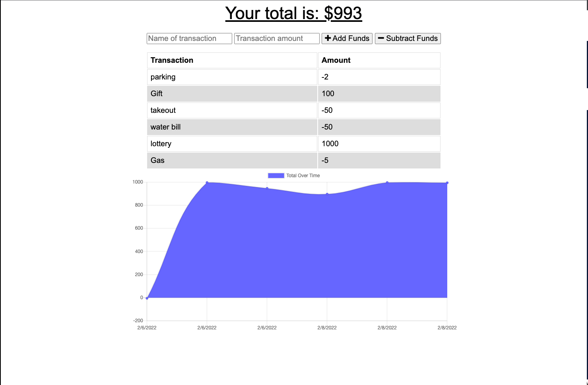

# Budget Tracker

 )

  ## Description
  The Budget Tracker application is a tool that allows users to quickly add withdrawal or deposit transactions with or without a data/internet connection.

  ## Table of Contents

  * [Usage](#Usage)
  * [Visuals](#usage)
  * [License](#license)
  * [Technologies](#technologies)
  * [Questions](#questions)
 

  ## Usage
    gh repo clone JessVarghese/Budget-Tracker
    npm start

  ## Visuals

  [VIDEO DEMO](https://watch.screencastify.com/v/qcsXr95Q7bcgu4r0O66q)

   

  ## License
  This project operates under the [MIT](https://choosealicense.com/licenses/MIT/) license.

  ## Technologies
 * Express
 * Mongoose
 * MongoDB Atlas

## Questions
  If you have any questions about the repo, open and issue:
  * Github: https://github.com/JessVarghese/Budget-Tracker